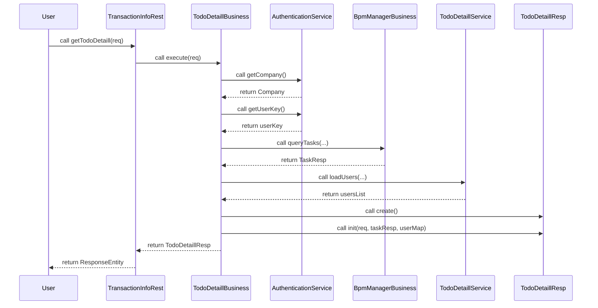

[TOC]

# 異動歷程

| 異動日期       | 動作 | 單號 | 異動內容   | 異動人   |
|------------|----|----|--------|:------|
| 2024/12/10 | 新增 |    | 新增 API | becky |

# API 規格

| 項目     | 說明                                                   |
|:-------|:-----------------------------------------------------|
| Method | POST                                                 |
| Url    | [Domain Name]/corpapi/TransactionInfo/getTodoDetaill |

## API 請求參數(header)

| 欄位名稱         | 格式     | 說明               |
|:-------------|:-------|:-----------------|
| Content-Type | string | application/json |

## Request

| 階層 | 欄位名稱        | 中文名稱         | 欄位     | M/O | 說明 |
|:--:|-------------|--------------|--------|-----|----|
| 1  | function    | 功能代碼         | String | M   |    |
| 1  | querySource | 查詢來源:web或app | String | M   |    |
| 1  | rolelist    | 角色清單         | String | M   |    |
| 1  | taskname    | 案件階層         | String | M   |    |

```json
{
  "function": "user-control",
  "querySource": "web",
  "rolelist": "Activity_34e05f75-01,Activity_34e05f75-02",
  "taskname": "Pass"
}

```

## Response

**成功**

| 階層 | 階層 | 階層 | 階層 | 欄位名稱        | 中文名稱 | 欄位     | M/O | 說明                                 |
|:--:|:--:|:--:|:--:|-------------|------|--------|-----|------------------------------------|
| 1  |    |    |    | messageid   | 回傳狀態 | string | M   | Return Status, 0為成功；1為異常           |
| 1  |    |    |    | messageDesc | 回傳說明 | string | M   | Return Status Description, 為0時回傳空值 |
| 1  |    |    |    | content     | 回傳資訊 | object | M   |                                    |
|    | 2  |    |    | data        | data | array  | M   |                                    |
|    |    | 3  |    | unid        | 公司統編 | string | M   |                                    |
|    |    | 3  |    | legalname   | 測試先生 | string | M   |                                    |

```json
{
  "messageid": "0",
  "messageDesc": "",
  "content": {
    "data": [
      {
        "unid": "A123456789",
        "legalname": "A123456789 測試先生"
      }
    ]
  }
}

```

**失敗**

| 階層 | 欄位名稱        | 中文名稱 | 欄位     | M/O | 說明                                 |
|:--:|-------------|------|--------|-----|------------------------------------|
| 1  | messageid   | 回傳狀態 | string | M   | Return Status, 0為成功；1為異常           |
| 1  | messageDesc | 回傳說明 | string | M   | Return Status Description, 為0時回傳空值 |
| 1  | content     | 回傳資訊 | object | M   |                                    |

```json
{
  "messageid": "1",
  "messageDesc": "Msg",
  "content": ""
}
```

# 流程



# 邏輯

## 參考

1. AuthenticationService

### DB

- [USERGROUP](/DB/MAIN/USERGROUP)
- [USERGROLE](/DB/MAIN/USERGROLE)

## 步驟一、檢核 Token 取得 公司資料

- 檢核登入者 token 格式
    - 檢核 Header Token,由 JSON Web Token 認證機制解譯,取得 行員資料
        - 查詢條件：
            - JWT.header.alg = "HS256"
            - JWT.header.typ = "JWT"
            - JWT.Signature.secrete = sha256Hex 加密 "nextbank"
            - JWT.payload.exp < 5分鐘
- 無法解譯，則 回傳錯誤碼「JWT_EXCEPTION」
    - 可解譯，則 回傳JWT解譯物件 （[公司資料](/DB/MAIN/COMPANY) , [使用者](/DB/MAIN/USERS)）
      ```json
        {
          "company":{},
          "users": {}
        }
      ```
- 取得 Company
- 取得 UserKey
- 取得 Company.CompanyKey
- 取得 Company.UserKey

## 步驟二、查詢使用者功能群組清單

- 查詢 [USERGROUP](/DB/MAIN/USERGROUP) 資料表
    - Table:
        - [USERGROUP](/DB/MAIN/USERGROUP)
        - 查詢條件：
            - UserGroup.UserKey = 步驟一、檢核 Token 取得 公司資料 之 UserKey

    - 有資料,則回傳所有欄位資料
    - 無資料,則回傳 null

## 步驟三、取出使用者功能群組清單Key 值

- 取出 步驟二、查詢使用者功能群組清單 所有 UserGroup.GroupKey

## 步驟四、查詢使用者角色清單

- 查詢 [USERGROLE](/DB/MAIN/USERGROLE) 資料表
    - Table:
        - [USERGROLE](/DB/MAIN/USERGROLE)
        - 查詢條件：
            - UserRole.GroupKey 存在於 步驟三、取出使用者功能群組清單Key 值

    - 有資料,則繼續步驟五
    - 無資料,則跳到步驟八

## 步驟五、取出使用者角色清單中簽核流程步驟Key 值

- 取出 步驟四、查詢使用者角色清單 所有 UserRole.FlowTaskKey

## 步驟六、查詢簽核流程步驟

- 查詢 [FLOWTASK](/DB/MAIN/FLOWTASK) 資料表
    - Table:
        - [FLOWTASK](/DB/MAIN/FLOWTASK)
        - 查詢條件：
            - FLOWTASK.ID 存在於 步驟五、取出使用者角色清單中簽核流程步驟Key 值

    - 有資料,則繼續步驟七
    - 無資料,則回傳 null

## 步驟七、取出簽核流程步驟Key 值

- 取出 步驟六、查詢簽核流程步驟 所有 FLOWTASK.FlowTaskId

## 步驟八、查詢使用者銀行帳號權限

- 查詢 [USERACCT](/DB/MAIN/USERACCT) 資料表
    - Table:
        - [USERACCT](/DB/MAIN/USERACCT)
        - 查詢條件：
            - USERACCT.USERKEY = 步驟一、檢核 Token 取得 公司資料 之 UserKey

    - 有資料,則繼續以下步驟
    - 無資料,則回傳空結果
- 排序條件：以銀行帳號所屬公司統一編號 USERACCT.ACCTUNID 升冪排序

## 步驟九、取出使用者銀行帳號權限中銀行帳號鍵值

- 取出所有 步驟八、查詢使用者銀行帳號權限 所有 USERACCT.DEPOSITACNOKEY

## 步驟十、查詢企業存款帳號

- 查詢 [DEPOSITACNO](/DB/MAIN/DEPOSITACNO) 資料表
    - Table:
        - [DEPOSITACNO](/DB/MAIN/DEPOSITACNO)
        - 查詢條件：
            - DEPOSITACNO.ID = 步驟九、取出使用者銀行帳號權限中銀行帳號鍵值

    - 有資料, 則繼續以下步驟
    - 無資料, 則回傳空結果

## 步驟十ㄧ、處理授權資訊

- 將不同的帳號授權資訊根據特定規則加入到Map
    - Map Key 為 DEPOSITACNO.ACCTUNID
    - Map Value 為 "ALL"

    - 最大群組授權（ALL）: Depositacnokey 為 null，Functiontype 為空，並且 Grantact 為 T，則認為是該統編的最大群組
      查詢待辦任務清單
      查詢功能